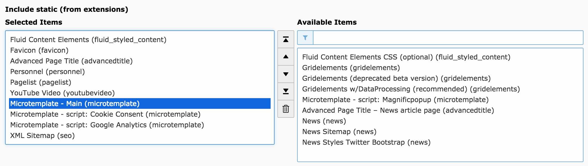

# Microtemplate
[](https://packagist.org/packages/t3brightside/microtemplate)
[](LICENSE)
[](https://t3brightside.com)

**TYPO3 CMS template extension for one page templates with light box like sub pages.**
<br />For building smaller scale websites for companies, startups or events.

**[Demo page](https://microtemplate.t3brightside.com/)**

## System requirements

- TYPO3 8.7 LTS, since 2.0.0 only TYPO3 9.5 LTS & 10.4 LTS & 11
- fluid_styled_content
- gridelements

## Features

It's a plug & play template that works out of the box. It's based on TYPO3 FLUID templates.

- Can be installed in multi domain setup or just for a sub page
- Modular architecture
- Lightweight (no CSS frameworks)
- Configurable color schemes
- Automatic main menu of section titles
- Content grids, accordion, cards
- Section background (color, image with effects, video)
- Section scroll in effect and angled edges
- IE 9 friendly except cards that use display: flex

## Install
- Install from TER **microtemplate** or composer **t3brightside/microtemplate**.
- or download [microtemplate_composer](https://github.com/t3brightside/microtemplate_composer) 
- **Note:** Include static templates in that order: **fluid_styled_content**, advancedpagetitle, personnel, pagelist, youtubevideo etc, **microtemplate, microtemplate scripts**.
 
- Edit constants for your needs.
- **Edit home page** to set _'Resources -> Include Page TSConfig -> Microtemplate – Main'_ and save
- **Edit home page** to set _'Appearance -> Page layout -> Backend layout  (this page only) -> Home'_ and _'Appearance -> Page layout (subpages of this page) -> Backend layout -> Sub'_

## Editors
- Logo can be added to home page _'Resources -> Media'_.
- To exclude content section from main menu uncheck _'Appearance -> Show in Section Menus'_ in section settings.
- To add Google Analytics on/off switch to the privacy page add following HTML as page content:
```html
<p>Google Analytics <b>Off/On</b>:
    <label class="switch">
      <input id="gaSwitch" type="checkbox">
      <span class="slider"></span>
    </label>
</p>
```

## Admins
- BE settings can be altered in: _Configuration/TypoScript/PageTS/setup.ts_

## Recommended
These extensions are preconfigured and tested in Microtemplate package.
- [personnel](https://extensions.typo3.org/extension/personnel/) – Contact persons information with vCard support
- [pagelist](https://extensions.typo3.org/extension/pagelist/) – Page teasers, articles, events etc
- [gallerycontent](https://extensions.typo3.org/extension/gallerycontent) – Gallery with preset crop ratios
- [youtubevideo](https://extensions.typo3.org/extension/youtubevideo/) – YouTube videos with cover images and cover text
- [favicon](https://extensions.typo3.org/extension/favicon/) – Favicon extension
- [advancedtitle](https://extensions.typo3.org/extension/advancedtitle/) – Page title prefix and suffix

## Sources

- [GitHub](https://github.com/t3brightside/microtemplate)
- [Packagist](https://packagist.org/packages/t3brightside/microtemplate)
- [TER](https://extensions.typo3.org/extension/microtemplate/)

## Development and maintenance

[Brightside OÜ – TYPO3 development and hosting specialised web agency](https://t3brightside.com/)
